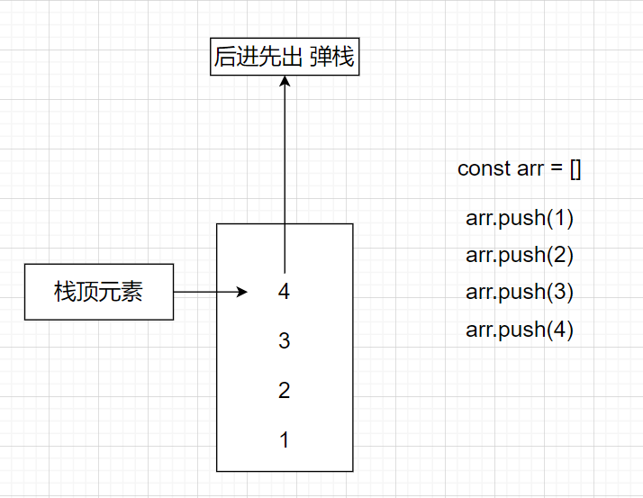

## 一. 栈结构 stack

### 1. 基本介绍

- 遵循后进先出原理
- 

### 2. 模拟栈结构

```
cosnt arr = []
```

- 压栈

  - arr.push(x)
- 弹栈

  - arr.pop()
- 返回栈顶元素

  - arr[arr.length - 1]
- clear 清空栈

  - arr.length = 0
- size 栈的大小

  - arr.length
- isEmpty

  - !arr.length

### 3. 算法题
